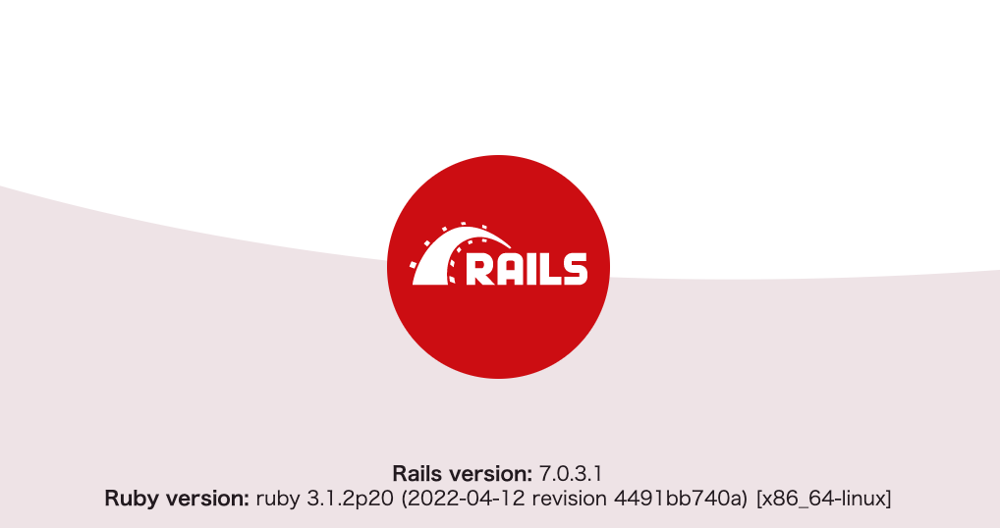

<!-- START doctoc generated TOC please keep comment here to allow auto update -->
<!-- DON'T EDIT THIS SECTION, INSTEAD RE-RUN doctoc TO UPDATE -->
**Table of Contents**

- [docker-rails7](#docker-rails7)
  - [version](#version)
  - [setup pre-commit](#setup-pre-commit)
  - [setup development environment](#setup-development-environment)
    - [build docker container & create rails application](#build-docker-container--create-rails-application)
    - [create database](#create-database)
    - [access rails application](#access-rails-application)
    - [db migrate & insert data](#db-migrate--insert-data)

<!-- END doctoc generated TOC please keep comment here to allow auto update -->

# docker-rails7

ruby on rais7 api mode on docker.

## version

Ruby : 3.1.2

Rails : 7.0.3

Postgres : 14.5

## setup pre-commit

install rbenv & pre-commit

```
brew install rbenv ruby-build
brew install pre-commit
```

install ruby & rubocop (for pre-commit)

```
rbenv install 3.1.2
rbenv local 3.1.2
rbenv exec gem install rubocop
rbenv exec gem install rubocop-performance
rbenv exec gem install rubocop-rails
```

apply pre-commit config

```
pre-commit install
```

## setup development environment

### create rails application

```
docker-compose run --rm --no-deps api rails new . --force --database=postgresql --api
```

### build docker container

```
cp -p local/rails/database.yml.org config/database.yml
docker-compose up -d --build
```

### create database

```
docker exec local_rails_api rake db:create
```

### access rails application

(it will take some time.)

access <http://localhost:3000/>

<div align="center">
  
</div>

### db migrate & insert data

```
docker exec local_rails_api rails generate scaffold user name:string age:integer area:string
docker exec local_rails_api rake db:migrate
```

write the following into db/seeds.rb

```
User.create(:name => 'Test', :age => '20', :area => 'Tokyo')
```

```
docker exec local_rails_api rails db:seed
```

access <http://localhost:3000/users>
